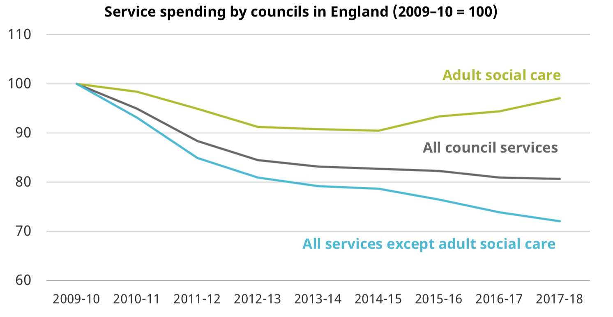
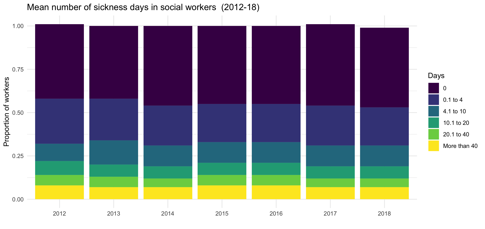

```{r setup, include=FALSE}
options(htmltools.dir.version = FALSE)
```

class: inverse, middle

# Social care ... why it matters ?

--

###  - About 1 in 4 adults require some sort of social care.

--

###  - Wider scope than healthcare.

--

###  - Organisation at local level ... consequences in other local public policy domains.

--

# There are several challenges 


---

# Challenge 1: Demographics and  population health

.pull-left[

- [**Ageing and longevity**](https://www.ageuk.org.uk/globalassets/age-uk/documents/reports-and-publications/later_life_uk_factsheet.pdf) : Greater share of elderly people (baby boomers getting old) that live longer.

- [**Complexity**](https://www.thelancet.com/journals/lanpub/article/PIIS2468-26671830118-X/fulltext) : Patients experiencing multi-morbidity and complex diseases.

- [**Unmet need**](https://www.kingsfund.org.uk/sites/default/files/2018-12/Key-challenges-facing-the-adult-social-care-sector-in-England.pdf) : Conflicting evidence on the trends over time. 

- [**Working age population**](https://www.kingsfund.org.uk/sites/default/files/2018-12/Key-challenges-facing-the-adult-social-care-sector-in-England.pdf) : More people in working age requiring social care support.

]

.pull-right[


Source: [Office National Statistics (2018)](https://www.ons.gov.uk/peoplepopulationandcommunity/healthandsocialcare/socialcare/adhocs/009317oldagedependencyratiooadrbycountiesandunitaryauthoritiesinenglandmid2016tomid2030)

]


---

# Challenges 2: Funding for social care

 - Decrease of [real social care expenditure](https://www.ifs.org.uk/uploads/BN240.pdf) per adult resident (10%) since  2009 -10.
 
 - [Fees-gap](https://www.pssru.ac.uk/pub/4559.pdf) between public and self supported residents (~ GBP40 per week).
 
 

 Source: [IFS (2018)](https://www.ifs.org.uk/uploads/BN240.pdf)
---

# Challenge 3: Workforce 

- Adequate [training and skill-mix](https://www.kingsfund.org.uk/sites/default/files/2018-12/Key-challenges-facing-the-adult-social-care-sector-in-England.pdf) for caring more complex residents.

- Poor labour conditions - i.e. staff levels, turnover and vacancy rates.

- Consequences for the [quality](https://www.pssru.ac.uk/pub/5328.pdf) of the services.



Source: [Skills for Care, NHS Digital (2019)](https://digital.nhs.uk/data-and-information/publications/statistical/personal-social-services-staff-of-social-services-departments/england-2018/content#resources)


---

class: inverse, center, middle

## How to maintain (or increase) the access and levels of quality? 

--

### What is the role of Social Care Sustainability Research Centre (SRC)

---


# Demand for social care 

- Understanding the **drivers** of the demand for social care.

  - Consequences of higher proportion of working-age adults with long-term conditions.
  
  - Effects of increasing demand and needs on other sectors - i.e NHS.
  
  - Refine models projecting future social care demand.
  

- Promote **awareness** of what social care is for society.

  - Elaborate intelligence and analysis accessible to current and future patients. 
  
  - More informed social care users. 
  
  - Prevent future demand for social care.


---

# Job market for social care

- Tackle the increase in **vacancy rates** and hurdles in recruiting (international) workers.

- Increase the **minimum wage**

  - Consequences of gap between care workers and senior care workers.
  
  - Gaps between workers hired by public and independent providers.

- Improve the **training of workforce** so that workers are able to deliver care.

- **Automatisation** of certain social care for a more personalised care

   - Physically assistive robots (PARs)
   
   - Socially assistive robotics
   
   - Cognitive Assistance Robots (CARs) 
   
   - Coordination of patient information. 
   
   - Supervision of patients behaviours. 
   
  
---

# Productivity and innovations 

- Role of **digital technologies** in social care. 


- New ways of delivering integrated care - e.g. **NHS Pioneers**

- **Patient experience** with new types of data (i.e. online reviews of the services).

- Ways of keeping more securely and sharing health and **social care information**. 

- Social care involving more **professional** backgrounds.

  - Social Workers.
  
  - Clinical workers.
  
  - Managers.
  
  - IT.
  
  - Data Scientists.
  
  - Other?


---

class: inverse, center, middle

# Thanks!


[@EdudinGonzalo](https://twitter.com/EdudinGonzalo)

[eduardogonzaloalmorox@gmail.com](eduardogonzaloalmorox@gmail.com)


